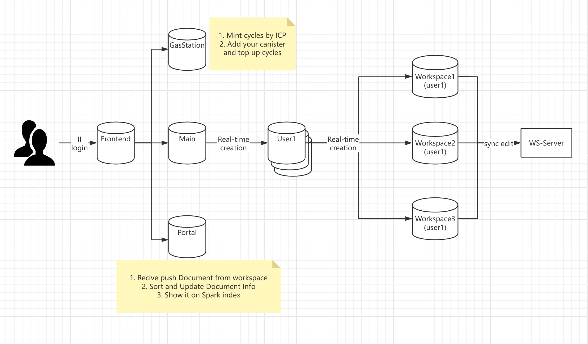

# SPARK
Hello! 大家好! 这里是Spark!  
Spark是一个基于[Internet Computer](https://internetcomputer.org/)的全链多人文档协同编辑管理、知识分享社区平台。支持用户进行多人团队管理、多人实时编辑、知识公开分享。  
网址: https://ic-spark.app  

## 介绍
Spark一款基于ICP链的全链文档协同管理平台，数据上链，完全由合约管理，无数据隐私泄漏、丢失风险，保证用户匿名性。  
产品按需付费使用，无梯度收费、功能收费机制，无需担心超额付费或者为不必要功能付费。  
支持多人实时在线协同编辑、Markdown语法兼容，团队成员管理，收入分配等。  

## 架构

## 使用文档

## 路线图
- [x] 用户管理、工作空间管理、空间成员管理基础功能  
- [x] 文章管理、多人协同编辑功能、资产管理和订阅付费、知识社区分享推荐展示  
- [x] Caiops管理系统(罐版本管理)  
- [] 链上文件系统  
- [] 工作空间、订阅等功能消息事件推送  
- [] 完善Portal模块，更亲和WEB3群体  
- [] ...  

## 参考
[Internet Computer Docs](https://internetcomputer.org/docs/current/home)  
[Internet Computer Forum](https://forum.dfinity.org/)  
[Internet Identity](https://internetcomputer.org/docs/current/developer-docs/identity/authentication/overview)  
[Examples Motoko](https://github.com/dfinity/examples/tree/master/motoko)  
[Ican Repo](https://github.com/PrimLabs/iCAN)  

